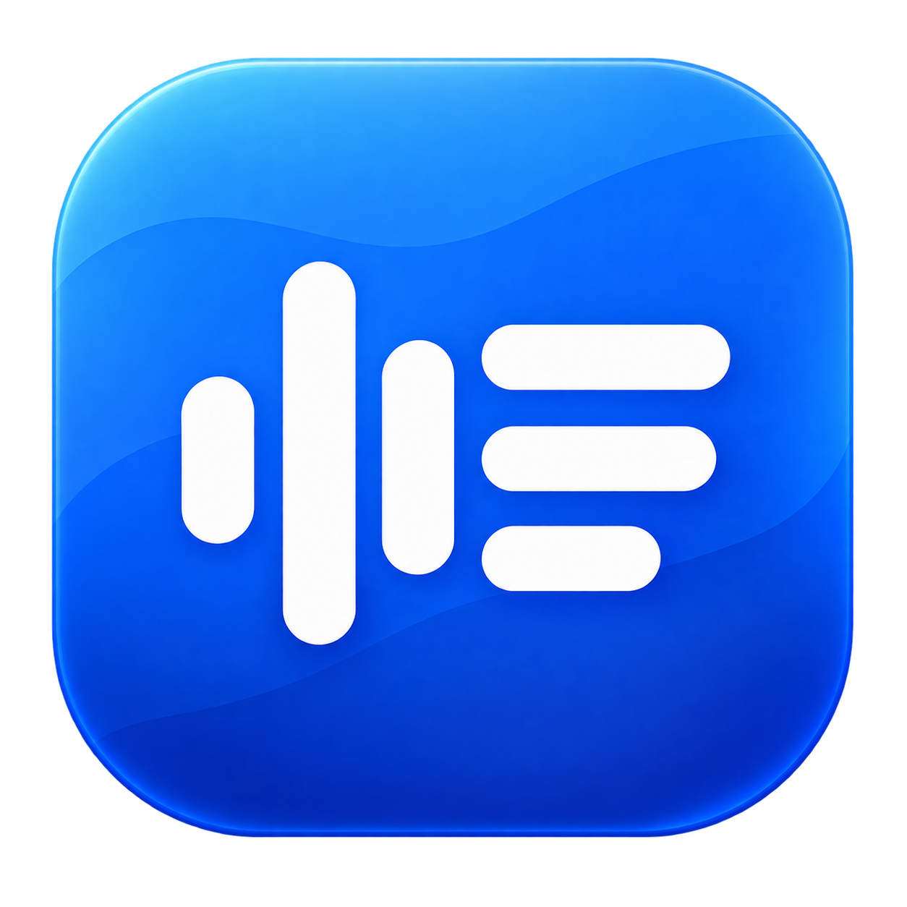

# Transcribator



Transcribator is a native macOS menu-bar app that records system audio and microphone input, then transcribes it through the OpenAI Transcriptions API or an existing ChatGPT app session. Optional Telegram and Discord integrations are included in the same repository.

## Features

- Native macOS menu-bar app: no virtual audio driver, Docker, Python, or ffmpeg required.
- Records system audio and microphone input; the microphone can be muted and both levels can be changed during recording.
- Cancels an active recording without saving audio, creating a transcript, or calling the API.
- Transcribes an existing audio or video file after extracting and compressing only its audio track locally.
- Saves transcripts as TXT and, optionally, recordings as M4A.
- Supports `gpt-transcribe`, `gpt-4o-transcribe-diarize`, `whisper-1`, and **GPT App**. GPT App uses the installed ChatGPT app’s existing session, without a separate API key or sign-in flow.
- Splits long audio automatically and cleans up working files.

## Quick start on macOS

Requirements: macOS 15 or later, plus an OpenAI API key for the first three models or a compatible installed ChatGPT app with an active session for GPT App.

1. Download the current **0.2.0** Universal DMG or ZIP from [Releases](https://github.com/Knstxx/TRANScribator/releases/tag/v0.2.0).
2. Drag **Transcribator** to **Applications**.
3. Open it; the app appears in the menu bar, not in the Dock.
4. Open **Settings**, check the ChatGPT connection or save an OpenAI API key, and choose output folders.
5. Allow **Microphone** and **Screen & System Audio Recording** when macOS asks, then restart the app.

Use **Transcribe file** in the menu to select an audio or video file. The source stays unchanged, video is not uploaded, and the resulting TXT is saved in the configured transcripts folder.

The API key is stored in macOS Keychain. API models send audio to `https://api.openai.com/v1/audio/transcriptions`. GPT App uses `https://chatgpt.com/backend-api/transcribe`, a private ChatGPT interface whose compatibility and limits may change. Its session token stays in memory and redirects are blocked. GPT App is disabled if the app or session is unavailable; sign in through ChatGPT itself. See [connection details](macos/README.md#gpt-app-текущая-сессия-chatgpt).

### First launch of an unsigned build

The current public build is ad-hoc signed because the project does not yet have an Apple Developer ID certificate. macOS may block the first launch:

1. Try to open `/Applications/Transcribator.app` once.
2. Open **System Settings → Privacy & Security**.
3. Find the blocked Transcribator message and click **Open Anyway**.

Verify `SHA256SUMS` from the release before bypassing the warning. Do not disable Gatekeeper globally. A Developer ID signing and notarization workflow is already supported by the build scripts; details are in [macos/README.md](macos/README.md).

## Optional Telegram and Discord integrations

Requirements: Docker Compose, an OpenAI API key, Telegram bot credentials, and/or a Discord bot token.

```bash
cp .env.example .env
openssl rand -hex 32
# Put the generated value and the required bot credentials into .env
docker compose up -d --build
```

Important settings:

- `TELEGRAM_ALLOWED_USERS` — comma-separated Telegram user IDs allowed to use the bot.
- `DISCORD_CHANNEL_ID` — the only Discord text channel where uploads and recording commands are accepted.
- `INTERNAL_API_TOKEN` — a random secret used only between the containers.

In Discord, `!record <voice_channel_id>` starts recording and `!stop` stops it. Record conversations only with the consent of every participant. Files handled through Telegram, Discord, and OpenAI are also subject to those services' privacy policies.

## Development

```bash
# Python
python -m pip install -r requirements-dev.txt
ruff format --check . && ruff check .
python -m unittest discover -s tests -v
pip-audit -r requirements.txt

# Node.js
cd recorder && npm ci && node --check index.js && npm audit --omit=dev

# macOS
swift run --package-path macos TranscribatorCoreChecks
macos/Scripts/check-gpt-app-session.sh
macos/Scripts/check-status-ui.sh
macos/Scripts/package-distribution.sh
```

More macOS build, recovery, signing, and notarization details are in [macos/README.md](macos/README.md). Third-party notices are in [macos/THIRD_PARTY_NOTICES.md](macos/THIRD_PARTY_NOTICES.md) and are also bundled with the application.

## License

[MIT](LICENSE)
